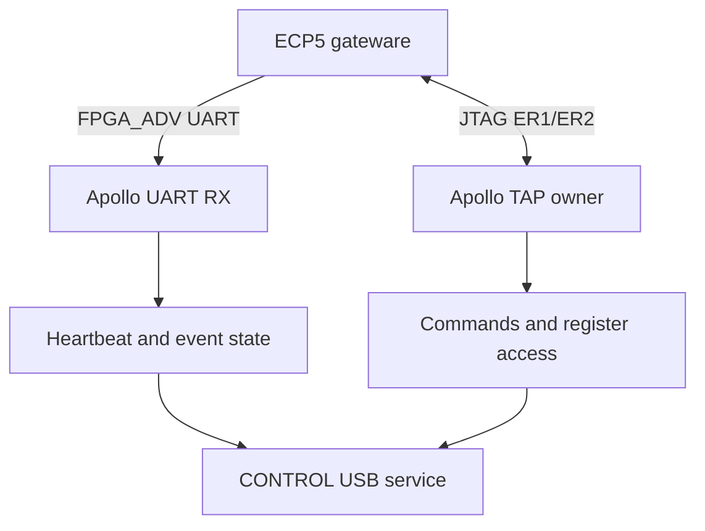

# Cynthion Apollo-to-FPGA Sideband Design and Test Methodology

## 1. Purpose and scope

This document defines a runtime management link between Cynthion's Apollo
(ATSAMD11) and ECP5 FPGA without changing the PCB and without disabling native
JTAG.

The design uses two complementary channels:
- FPGA_ADV: a one-way FPGA-to-Apollo UART for heartbeat, urgent events, and
	compact telemetry.
- ECP5 JTAG ER1/ER2: a bidirectional command, register, and FIFO channel.

Apollo accelerates long JTAG shifts with its SERCOM SPI peripheral, as it
already does for JTAG operations.

The first implementation milestone is intentionally small: the FPGA repeatedly
transmits a valid identity/heartbeat packet on FPGA_ADV, and Apollo validates
it. The JTAG runtime protocol can then be added without making basic liveness
dependent on JTAG availability.

## 2. Physical interfaces

### 2.1 Dedicated telemetry wire

| Function | ATSAMD11 | ECP5 | Direction |
| --- | --- | --- | --- |
| UART telemetry | PA09, SERCOM1 PAD3 RX | T6, FPGA_ADV | FPGA -> Apollo |

FPGA_ADV is an ordinary FPGA fabric IO. Configure both ends for 3.3 V logic.
The FPGA drives push-pull. Apollo only receives and must never enable its
output driver on PA09 while this protocol is active.

During FPGA configuration, T6 may be high impedance. Apollo should enable its
internal pull-up before enabling the UART receiver. This keeps the UART in its
idle-high state and prevents a floating input from generating false start bits.

After configuration, the FPGA should drive the line high whenever its
transmitter is idle.

This first design is intentionally unidirectional. A bidirectional push-pull
single-wire design risks contention, and an open-drain design needs a suitable
external pull-up for reliable high-speed operation.

### 2.2 Runtime JTAG channel

| JTAG role | ATSAMD11 | ECP5 |
| --- | --- | --- |
| TDI / serial data to FPGA | PA14, SERCOM0 PAD0 | TDI |
| TCK / clock | PA15, SERCOM0 PAD1 | TCK |
| TDO / serial data from FPGA | PA10, SERCOM0 PAD2 | TDO |
| TMS / TAP control | PA11, GPIO | TMS |

The FPGA bitstream instantiates the ECP5 JTAGG primitive and enables a user
instruction such as ER1. Apollo moves the TAP into Shift-DR, uses hardware SPI
for byte-aligned TDI/TDO shift, and then exits Shift-DR using TMS.

This does not reclaim the JTAG pins as GPIO and does not disable JTAG. Only
one operation can own the TAP at a time. Apollo firmware therefore needs one
lock covering runtime ER transfers, FPGA programming, and debug scans.

### 2.3 Configuration signals

PROGRAMN, INITN, and DONE keep their configuration-management roles. They are
useful to force reconfiguration and observe configuration state, but this
design does not depend on treating them as arbitrary runtime fabric IO.

## 3. Architecture

The UART remains usable whenever the FPGA user design is running, including
while the JTAG TAP is occupied by another Apollo-mediated operation. The UART
is not a substitute for DONE: UART silence means the runtime design is not
communicating, whereas DONE says whether configuration completed.

## 4. UART electrical and timing definition

- Format: 8 data bits, no parity, 1 stop bit (8-N-1).
- Bit order: least-significant bit first.
- Polarity: idle high, start bit low, stop bit high.
- Initial rate: 1,000,000 baud.
- Initial tolerance objective: receiver and transmitter error combined below
	2 percent.
- No flow control.
- Back-to-back characters are allowed.

At 1 Mbaud, each bit lasts 1 microsecond and each 10-bit UART character lasts
10 microseconds. The theoretical payload rate is 100,000 bytes/s.

Suggested operating targets:

| Traffic class | Target |
| --- | --- |
| Heartbeat | 10 packets/s |
| Routine status | 1 to 10 packets/s |
| Urgent event latency | below 5 ms when FIFO is not congested |
| Sustained UART occupancy | below 25 percent |
| Transmit FIFO | at least 256 bytes initially |

## 5. Packet protocol

### 5.1 Framing

Use COBS with 0x00 as the packet delimiter. COBS ensures that a received zero
always terminates a frame and lets the receiver recover cleanly after reset,
byte loss, or corruption.

Decoded frame layout:

| Offset | Size | Field |
| --- | --- | --- |
| 0 | 1 | Protocol version |
| 1 | 1 | Message type |
| 2 | 1 | Flags |
| 3 | 1 | Payload length (0 to 48) |
| 4 | 2 | Sequence number, little-endian |
| 6 | 4 | FPGA uptime in milliseconds, little-endian |
| 10 | N | Payload |
| 10 + N | 2 | CRC-16/CCITT-FALSE over bytes 0 through 9 + N |

The entire decoded frame is COBS-encoded and followed by 0x00.

CRC parameters:
- Polynomial: 0x1021
- Initial value: 0xFFFF
- Reflect input/output: false
- Final XOR: 0x0000
- Check value for ASCII 123456789: 0x29B1

### 5.2 Initial message types

| Type | Name | Payload |
| --- | --- | --- |
| 0x01 | BOOT | build ID, reset cause, feature flags |
| 0x02 | HEARTBEAT | state, FIFO levels, sticky fault flags |
| 0x03 | EVENT | event code, source, event-specific data |
| 0x04 | COUNTERS | selected USB/error counters |
| 0x7F | PANIC | fault code and compact diagnostic state |

Every packet increments the 16-bit sequence number. A sequence gap means at
least one packet was lost, discarded, or corrupted.

### 5.3 Fixed first-test packet

Before implementing COBS/CRC/FIFO, send a recognizable raw test pattern:

`C1 14 01 A5`

Transmit once every 100 ms at 1 Mbaud.

## 6. FPGA design

### 6.1 Module breakdown

Implement these Amaranth modules separately:
- BaudTick: fractional or integer tick generation.
- UartTx: one-byte ready/valid input, 8-N-1 serial output.
- ByteFifo: buffers complete encoded packets.
- Crc16Ccitt: streaming CRC calculation.
- CobsEncoder: converts decoded packet to encoded bytes.
- TelemetryProducer: creates boot/heartbeat/event records.
- TelemetryArbiter: priority over periodic status.
- JtagRuntimePort: later ER1/ER2 command/register interface.

Keep the initial hardware proof smaller: BaudTick, UartTx, a ROM containing
four ID bytes, and a 100 ms interval timer.

### 6.2 UART transmitter state machine

The transmitter contains a 10-bit shift register:

`{stop=1, data[7:0], start=0}`

On `valid && ready`, load the register, set bit count to 10, and drive start
bit. On each baud tick, shift right and decrement count. `ready` becomes true
only after stop bit completes.

Required simulation assertions:
- Output is high after reset and whenever idle.
- A byte consumes exactly 10 bit periods.
- Data appears LSB first.
- `ready` cannot assert before stop bit completes.
- Input data is captured only on `valid && ready`.

### 6.3 Clock divider

For clock $f_{clk}$ and baud $f_{baud}$:

$$
divider = \text{round}(f_{clk}/f_{baud})
$$

$$
actual\_baud = f_{clk}/divider
$$

$$
error = (actual\_baud - f_{baud}) / f_{baud}
$$

If the gateware clock does not divide cleanly, use a phase accumulator.

### 6.4 FIFO and overload policy

Never permit routine telemetry to overwrite an urgent event already queued.

When congested:
- Coalesce or discard oldest low-priority status.
- Increment telemetry-drop counter.
- Set sticky overflow flag in next successful heartbeat.
- Preserve first occurrence of each important fault until read/cleared.

The UART is observational; congestion must never stall the timing-critical USB
datapath.

### 6.5 Reset behavior

On FPGA user reset:
- Drive TX high immediately.
- Clear UART and packet FIFOs.
- Reset sequence to zero.
- Wait at least two character times after clocks are stable.
- Emit three BOOT packets, 20 ms apart.
- Begin normal heartbeats.

## 7. Apollo firmware design

### 7.1 Receiver setup

Configure PA09 as input with internal pull-up before FPGA configuration. After
configuration, select PA09 function C (`SERCOM1/PAD3`) and configure
asynchronous UART reception at 1 Mbaud, 8-N-1.

Use interrupt- or DMA-backed circular buffering. Do not block CONTROL USB
handling.

### 7.2 Receive pipeline

`SERCOM RX -> byte ring -> delimiter scan -> COBS decode -> length check -> CRC check -> sequence check -> message dispatch`

Hard limits:
- Maximum encoded frame length: 64 bytes initially.
- Discard overlength frame until next zero delimiter.
- Never allocate memory from unvalidated length.

### 7.3 Liveness states

| State | Evidence |
| --- | --- |
| UNCONFIGURED | DONE inactive |
| STARTING | DONE active, no valid BOOT/heartbeat yet |
| HEALTHY | recent valid CRC-protected heartbeat |
| SILENT | configured but heartbeat deadline expired |

Recommended initial timers:
- Expected heartbeat interval: 100 ms.
- Warning after 500 ms without valid heartbeat.
- Fault after 1 second.

### 7.4 JTAG ownership

All TAP users acquire the same mutex. Before and after each owner, return TAP
to known state by holding TMS high for at least five TCK edges.

## 8. JTAG runtime protocol outline

Keep UART unidirectional and small. Use ER1/ER2 for:
- Capability/build ID registers.
- Reading/clearing sticky faults.
- FIFO fill levels and counters.
- Command/response FIFOs.

A practical split:
- ER1: fixed-size 32- or 64-bit control/status shift register.
- ER2: byte-stream FIFO window with available/free counts in ER1.

## 9. Test methodology

### Phase 0: board and tool verification

Confirm:
- Board revision and exact FPGA package.
- Continuity from ECP5 T6 to SAMD11 PA09.
- IO bank voltage is 3.3 V.
- PA09 SERCOM mux from exact ATSAMD11 datasheet/header.

### Phase 1: UART unit simulation

Test all byte values 0x00..0xFF at least once, plus directed cases and random
idle gaps. Pass criteria: zero mismatches in directed tests and at least
100,000 random bytes.

### Phase 2: physical signal proof

Load minimal repeating-ID bitstream and measure:
- Idle near 3.3 V.
- Bit time 1.000 microsecond at 1 Mbaud within 1 percent.
- Repeating `C1 14 01 A5` decode.

### Phase 3: Apollo receiver proof

Expose counters over CONTROL USB:
- `rx_bytes`
- `good_patterns`
- `framing_errors`
- `overruns`
- `last_rx_ms`

### Phase 4: framed protocol tests

Inject corruption, deletion, duplication, truncation. Pass criteria:
- Corrupted frames rejected unless by chance valid CRC.
- Decoder resynchronizes at next delimiter.
- Invalid traffic never refreshes liveness.

### Phase 5: load and soak

Run sustained routine telemetry plus bursts of high-priority events while
stressing CONTROL USB, AUX USB, and JTAG transfers.

Run 24 hours initially, then 72 hours for stability sign-off.

### Phase 6: fault injection and recovery

Inject clock stoppage, reset, reconfiguration, forced line states, FIFO
overflow, interrupted JTAG transaction, and random serial corruption.

### Phase 7: baud-rate characterization

After 1 Mbaud passes all phases, repeat at 2, 3, and 6 Mbaud if useful.
Select the fastest rate with margin under worst realistic load.

## 10. Required observability

Expose at least these counters through CONTROL USB and later through ER1:
- UART bytes received
- Valid packets
- UART framing errors
- Receive-buffer overruns
- COBS errors
- Length errors
- CRC errors
- Sequence gaps
- Heartbeat timeouts
- FPGA telemetry FIFO high-water mark
- FPGA low-priority drops
- FPGA high-priority drops
- JTAG arbitration waits and aborted transactions

## 11. Acceptance criteria for first deliverable

First milestone complete when:
- Minimal bitstream builds and claims only T6 for new UART.
- Logic analyzer decodes `C1 14 01 A5` at 1 Mbaud.
- Apollo receives pattern through SERCOM without polling.
- Apollo recovers after either side resets.
- CONTROL USB reports receive count, error count, and last-received time.

## 12. Design conclusions

- Use FPGA_ADV as one-way, idle-high FPGA-to-Apollo UART.
- Start at 1 Mbaud.
- Use UART framing first, then COBS-delimited packets with CRC.
- Treat valid packet as heartbeat, not mere pin toggles.
- Keep JTAG enabled and use JTAGG ER registers for bidirectional management.
- Preserve DONE/INITN/PROGRAMN for configuration lifecycle and recovery.