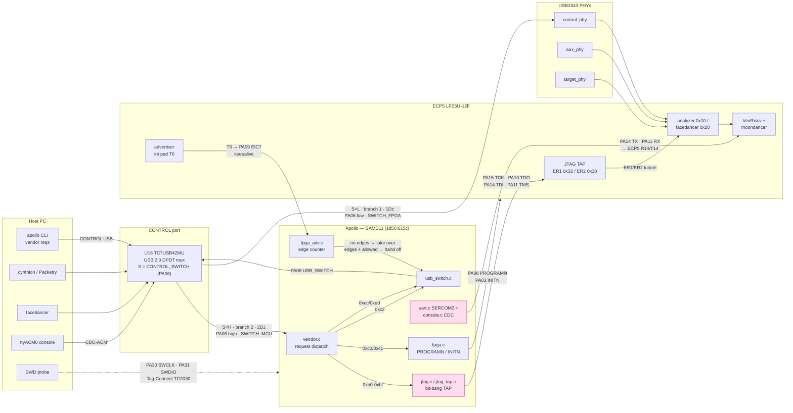

## Hardware Architecture

Every assertion in this document is traceable to source in `repos/`. Where a
claim was verified, the file and line are cited inline. Board-specific detail is
for **Cynthion r1.4** (`LFE5U-12F`, `BG256`) with the `cynthion_d11` Apollo build
(SAMD11) unless stated otherwise.

### Block Diagram

```
HOST PC
├─ CONTROL USB (Type-C) ──► TC7USB42MU mux ──┬──► Apollo SAMD11  (1d50:615c)
│                              ▲             └──► control_phy (USB3343) ──► ECP5
│                              │
│                    CONTROL_SWITCH (PA06, MCU output)
│                              │  ▲
│                              │  └── FPGA_ADV keepalive (ECP5 T6 → MCU PA09/EIC7)
│                              │
│                       Apollo ──JTAG (PA10/11/14/15)──► ECP5 TAP (R11/T11/…)
│                       Apollo ──UART (PA11/PA14)─────► ECP5 R14/T14 ──► VexRiscv
│                                (same MCU pins as JTAG — mutually exclusive)
│
├─ AUX USB (Type-C) ──► aux_phy (USB3343) ──► ECP5
│
└─ TARGET-C / TARGET-A ──► target_phy (USB3343) + direct D+/D- taps ──► ECP5
                              (analyzer capture, or moondancer/facedancer emulation)
```

Cynthion enumerates as **one device ID per personality**, distinguished by
interface subclass — not by PID:

| Personality | VID:PID | bInterfaceClass | bInterfaceSubClass | Source |
|---|---|---|---|---|
| Apollo debug firmware | `1d50:615c` | 0xFF | — | [apollo_board.h:15-16](repos/apollo/firmware/src/boards/cynthion_d11/apollo_board.h#L15-L16) |
| Saturn-V DFU bootloader | `1d50:615c` | — | — | [usb.c:33-34](repos/saturn-v/usb.c#L33-L34) |
| Gateware — Apollo stub / flash bridge | `1d50:615b` | 0xFF | `0x00` | [usb.toml:72](repos/cynthion/shared/usb.toml#L72) |
| Gateware — analyzer | `1d50:615b` | 0xFF | `0x10` | [usb.toml:73](repos/cynthion/shared/usb.toml#L73) |
| Gateware — moondancer/facedancer | `1d50:615b` | 0xFF | `0x20` | [usb.toml:74](repos/cynthion/shared/usb.toml#L74) |

Apollo host-side also accepts `1209:0010` for Apollo and a set of pid.codes test
PIDs (`1209:0001..0005`, and `1209:000f` for the flash bridge) as gateware IDs
([__init__.py:50-59](repos/apollo/apollo_fpga/__init__.py#L50-L59)). The
FlashBridge gateware is a separate device identity, `1209:000f`, whose bulk
interface uses subclass `0x01` — see [`flash --fast`](#flash---fast--the-deliberate-handoff-path).

**UTi261M** — UNI-T thermal imaging camera, `0bda:5830` (Realtek UVC), attached
to TARGET-C and proxied by facedancer out through TARGET-A.

---

### Datapaths — Module Grid

Each row is one end-to-end path. Read left to right: the host-visible endpoint,
each module the data crosses, and the physical wires between them.

#### Control-plane paths (host → Apollo MCU)

All of these require the CONTROL mux set to **branch 2** (`S`=H, PA06 high,
Apollo owns the port). If the FPGA holds the port, the host must first stop the
keepalive (vendor `0xF0` to the stub interface) so Apollo reclaims it.

| # | Path | Host endpoint | Transport | MCU module | Physical link | Endpoint | Verified |
|---|---|---|---|---|---|---|---|
| 1 | **JTAG over USB** | CONTROL USB `1d50:615c` | Vendor req `0xb0`–`0xb7`, `0xbe`, `0xbf` | `jtag.c` / `jtag_tap.c`, bit-banged | PA15=TCK, PA10=TDO, PA14=TDI, PA11=TMS | ECP5 TAP | [vendor.c:42-52](repos/apollo/firmware/src/vendor.c#L42-L52), [apollo_board.h:44-50](repos/apollo/firmware/src/boards/cynthion_d11/apollo_board.h#L44-L50) |
| 2 | **UART / console over USB** | CONTROL USB, CDC-ACM (1 interface) | CDC bulk | `console.c` + `uart.c` (SERCOM2) | PA14=TX (PAD0), PA11=RX (PAD3) → ECP5 R14/T14 | VexRiscv soft core | [uart.c:39-44](repos/apollo/firmware/src/boards/cynthion_d11/uart.c#L39-L44), [cynthion_r1_4.py:86-90](repos/cynthion/cynthion/python/src/gateware/platform/cynthion_r1_4.py#L86-L90) |
| 3 | **FPGA reconfigure (PROGRAMN)** | CONTROL USB | Vendor req `0xc0` | `fpga.c` | PA08 = FPGA_PROGRAM (open-drain: driven low, then released to input) | ECP5 PROGRAMN | [fpga.c:52-76](repos/apollo/firmware/src/boards/cynthion_d11/fpga.c#L52-L76) |
| 4 | **Force FPGA offline** | CONTROL USB | Vendor req `0xc1` | `fpga.c` + `permit_fpga_configuration()` | PA03 = FPGA_INITN (r1.3+ only) | ECP5 INITN | [fpga.c:22-35](repos/apollo/firmware/src/boards/cynthion_d11/fpga.c#L22-L35) |
| 5 | **Allow USB takeover** | CONTROL USB | Vendor req `0xc2` | `fpga_adv.c` → `usb_switch.c` | PA06 = USB_SWITCH → TC7USB42MU | CONTROL mux | [vendor.c:57](repos/apollo/firmware/src/vendor.c#L57), [usb_switch.c:38-44](repos/apollo/firmware/src/usb_switch.c#L38-L44) |
| 6 | **Emergency reset** | CONTROL USB | Vendor req `0xec` | `vendor.c` `handle_emergency_reset()` | — (releases JTAG pin lock, drops takeover policy) | control-plane state | [vendor.c:349-358](repos/apollo/firmware/src/vendor.c#L349-L358) |
| 7 | **Boot to DFU** | CONTROL USB | Vendor req `0xed`, action deferred to ACK stage | `vendor.c` → TinyUSB DFU-runtime | WDT reset → Saturn-V | Saturn-V `1d50:615c` | [vendor.c:241-251](repos/apollo/firmware/src/vendor.c#L241-L251) |
| 8 | **LED pattern** | CONTROL USB | Vendor req `0xa1` | `led.c` | PA16/17/22/23/27 (LED A–E) | 5 MCU LEDs | [apollo_board.h:30-38](repos/apollo/firmware/src/boards/cynthion_d11/apollo_board.h#L30-L38) |
| 9 | **ADC / rail voltage** | CONTROL USB | Vendor req `0xa4` | `board_rev.c` `get_adc_reading()` | ADC on rev-detect divider | board revision | [vendor.c:176-183](repos/apollo/firmware/src/vendor.c#L176-L183) |
| 10 | **Microsoft WCID** | CONTROL USB | Vendor req `0xee` | `vendor.c` const descriptors | — | Windows WinUSB bind | [vendor.c:87-140](repos/apollo/firmware/src/vendor.c#L87-L140) |

#### FPGA-side and sideband paths

| # | Path | Source | Transport | Modules crossed | Physical link | Sink | Verified |
|---|---|---|---|---|---|---|---|
| 11 | **FPGA_ADV keepalive** | ECP5 gateware | 50 Hz square wave (analyzer) **or** `C1 14 01 A5` UART burst @1 Mbaud/100 ms (facedancer) | `advertiser.py` → `int` pad | ECP5 T6 → MCU PA09 (EIC EXTINT7) | `fpga_adv.c` edge counter, 200 ms window, threshold >2 | [advertiser.py:42-51](repos/apollo/apollo_fpga/gateware/advertiser.py#L42-L51), [advertiser.py:64-126](repos/cynthion/cynthion/python/src/gateware/facedancer/advertiser.py#L64-L126), [fpga_adv.c:83-137](repos/apollo/firmware/src/boards/cynthion_d11/fpga_adv.c#L83-L137) |
| 12 | **Advertiser stop (handoff to Apollo)** | Host | Vendor req `0xF0` to stub interface, recipient=INTERFACE | `ApolloAdvertiserRequestHandler` in gateware | — (asserts `stop`, keepalive ceases) | Apollo takes CONTROL mux back within one 200 ms window | [advertiser.py:65-97](repos/apollo/apollo_fpga/gateware/advertiser.py#L65-L97), [__init__.py:110-131](repos/apollo/apollo_fpga/__init__.py#L110-L131) |
| 13 | **JTAG-tunnelled SPI (ER1/ER2)** | Host | JTAG opcodes `0x32` (ER1) / `0x38` (ER2) over path 1 | `ECP5_JTAGDebugSPIConnection`, `ECP5_JTAGRegisters` | Same JTAG pins as path 1 | ECP5 user-fabric SPI/registers (ILA, debug) | [ecp5.py:1098-1101, 1216-1222](repos/apollo/apollo_fpga/ecp5.py#L1216-L1222), [__init__.py:346-360](repos/apollo/apollo_fpga/__init__.py#L346-L360) |
| 14 | **Configuration flash — slow path** | Host | JTAG (path 13); `ECP5_JTAGProgrammer` bit-bangs the whole image | Apollo `jtag_tap.c` → ECP5 TAP → fabric | T8=SDI, T7=SDO, N8=CS, SCK via USRMCLK | SPI config flash | [cli.py:164-177](repos/apollo/apollo_fpga/commands/cli.py#L164-L177), [cynthion_r1_4.py:60-79](repos/cynthion/cynthion/python/src/gateware/platform/cynthion_r1_4.py#L60-L79) |
| 14b | **Configuration flash — `flash --fast`** | **FlashBridge gateware on the FPGA**, `1209:000f`, bulk iface subclass `0x01`, EP1 in/out, 512 B packets | USB bulk directly to the FPGA — **not** through Apollo | `FlashBridgeSubmodule` → ECP5 fabric SPI | same flash pins | SPI config flash | [cli.py:181-218](repos/apollo/apollo_fpga/commands/cli.py#L181-L218), [flash_bridge.py:27-31, 247-348](repos/apollo/apollo_fpga/gateware/flash_bridge.py#L247-L348) |
| 15 | **Self-reprogram** | ECP5 gateware | GPIO assert | `self_program` resource | ECP5 T13 → PROGRAMN | ECP5 reconfigures itself | [cynthion_r1_4.py:99](repos/cynthion/cynthion/python/src/gateware/platform/cynthion_r1_4.py#L99) |
| 16 | **USER button** | User | GPIO | `button_user` resource | ECP5 M14 (active-low, `PinsN`) | Gateware-defined | [cynthion_r1_4.py:96](repos/cynthion/cynthion/python/src/gateware/platform/cynthion_r1_4.py#L96) |
| 17 | **PROGRAM button** | User | GPIO, sampled at boot and in `button_task()` | `button.c` | MCU PA02 (r0.6+) / PA16 shared w/ LED_A (< r0.6) | Forces FPGA offline + Apollo takes CONTROL | [apollo_board.h:58-65](repos/apollo/firmware/src/boards/cynthion_d11/apollo_board.h#L58-L65), [main.c:61-74](repos/apollo/firmware/src/main.c#L61-L74) |
| 18 | **PMOD A** | User | 8 GPIO | `user_pmod` 0 | ECP5 C9 B9 D11 C12 / C8 D8 D9 C10 | External PMOD | [cynthion_r1_4.py:182,190](repos/cynthion/cynthion/python/src/gateware/platform/cynthion_r1_4.py#L182-L190) |
| 19 | **PMOD B** | User | 8 GPIO | `user_pmod` 1 | ECP5 B4 B5 B6 B7 / C5 A5 A6 A7 | External PMOD | [cynthion_r1_4.py:183,191](repos/cynthion/cynthion/python/src/gateware/platform/cynthion_r1_4.py#L183-L191) |
| 20 | **Mezzanine** | User | 22 GPIO, `SLEWRATE=FAST` | `user_mezzanine` 0 | ECP5 B8 A9 B10 A10 B11 D14 C14 F14 E14 G13 G12 C16 C15 B16 B15 A14 B13 A13 D13 A12 B12 A11 | Mezzanine board | [cynthion_r1_4.py:184-186,192-193](repos/cynthion/cynthion/python/src/gateware/platform/cynthion_r1_4.py#L184-L193) |
| 21 | **SWD (MCU debug)** | External probe | SWD | SAMD11 DSU/DAP — **not** routed through USB | PA30=SWCLK, PA31=SWDIO on Tag-Connect TC2030-CTX | SAMD11 core | [debugger.kicad_sch:456-464,1300-1312,1760-1772](repos/cynthion-hardware/debugger.kicad_sch) |

#### USB data paths (the instrument's actual job)

| # | Path | Port | Mux setting required | PHY | Gateware | Firmware | Host software |
|---|---|---|---|---|---|---|---|
| 22 | **Analyzer capture** | TARGET-C in / TARGET-A out | n/a (mux is CONTROL-only) | `target_phy` (R2…M1, clk T4) + direct D+/D- taps N4/P3 | `analyzer/top.py`, subclass `0x10` | — (pure gateware + FIFO) | `cynthion` CLI / Packetry |
| 23 | **Facedancer emulation** | TARGET-C | n/a | `target_phy` | `facedancer/top.py`, subclass `0x20` | moondancer (Rust, VexRiscv) via GCP | `facedancer` Python |
| 24 | **Gateware→host bulk (control port)** | CONTROL USB | **branch 1**, `S`=L, PA06 low | `control_phy` (N16…P14, clk L14) | analyzer or facedancer top | — | as above |
| 25 | **AUX port** | AUX USB | n/a — AUX is not muxed | `aux_phy` (F16…K16, clk D16) | `default_usb_connection = "aux_phy"` | — | as above |

Only the **CONTROL** port is muxed. AUX and TARGET are hardwired to their PHYs,
which is why AUX is the default `default_usb_connection` for gateware that wants
a host link without fighting Apollo for the control port
([cynthion_r1_4.py:26](repos/cynthion/cynthion/python/src/gateware/platform/cynthion_r1_4.py#L26)).

USB ports: **three Type-C** (CONTROL, AUX, TARGET-C) plus **TARGET-A** (type-A
receptacle sharing `target_phy` with TARGET-C). Buttons: **two** — PROGRAM
(MCU-owned) and USER (FPGA-owned) — plus the RESET button which resets the MCU
(and, via the normal boot path, the FPGA too).

---

### Mermaid — full datapath map



**Pink = the pin-sharing hazard**: JTAG and UART occupy the same MCU pins
(PA11, PA14). They cannot both be active.

### Mermaid — CONTROL port arbitration state

```mermaid
stateDiagram-v2
    [*] --> BootDecision: power on / RESET

    BootDecision --> ApolloHolds: PROGRAM button pressed
    BootDecision --> FPGAHasPort: normal boot

    ApolloHolds: Apollo owns CONTROL<br/>MUX S=H · branch 2 · PA06 high<br/>take_over_usb() — 1d50:615c
    FPGAHasPort: FPGA owns CONTROL<br/>MUX S=L · branch 1 · PA06 low<br/>hand_off_usb() — 1d50:615b

    FPGAHasPort --> ApolloHolds: keepalive stops<br/>(<=2 edges in 200 ms)
    ApolloHolds --> FPGAHasPort: keepalive resumes<br/>AND takeover allowed (0xc2)

    ApolloHolds --> JTAGProgramming: first 0xb1/b3/b4/b5/b7
    JTAGProgramming --> ApolloHolds: JTAG_STOP (0xbe) or 0xec
    JTAGProgramming: programming_active — conflicting<br/>requests STALLed; UART repinmux blocked

    ApolloHolds --> DFU: 0xed
    DFU: Saturn-V bootloader 1d50:615c
    DFU --> BootDecision: firmware written

    ApolloHolds --> BridgeLoaded: flash --fast<br/>JTAG-configure FlashBridge into SRAM
    BridgeLoaded: bridge in FPGA SRAM, advertising<br/>mux still S=H (Apollo)
    BridgeLoaded --> BridgeOwnsPort: 0xc2 allow takeover
    BridgeOwnsPort: MUX S=L · branch 1<br/>1209:000f subclass 0x01<br/>bulk flash write, Apollo out of path
    BridgeOwnsPort --> ApolloHolds: 0xF0 request_handoff()<br/>(on __del__)
```



---

### Corrections to the previous revision

Seven assertions in the prior version of this file did not survive checking:

| # | Previous claim | Actual | Evidence |
|---|---|---|---|
| 1 | "USB VID:PID 1d50:615b (all gateware modes)" listed under **Cynthion**, implying Apollo too | Apollo is **`1d50:615c`**; only gateware is `615b` | [apollo_board.h:15-16](repos/apollo/firmware/src/boards/cynthion_d11/apollo_board.h#L15-L16) |
| 2 | "Apollo bootloader: `1d50:60e6`" | Saturn-V uses **`1d50:615c`** — the same ID as Apollo firmware. `60e6` appears nowhere in the tree. | [usb.c:33-34](repos/saturn-v/usb.c#L33-L34) |
| 3 | "If the board enumerates as `1d50:615b`, it is … not ready for Apollo DFU flashing" | Follows from #2 being wrong. `615b` means gateware is running; a `0xF0` advertiser-stop or `--force-offline` handoff recovers the port. Distinguishing DFU from Apollo firmware needs the **interface descriptor**, not the PID. | [__init__.py:110-131](repos/apollo/apollo_fpga/__init__.py#L110-L131) |
| 4 | "USB interface subclass: 0x10 = analyzer, 0x20 = moondancer" — incomplete | Correct as far as it goes, but omits **`0x00` = Apollo stub / flash bridge**, which is the subclass the handoff path actually matches on | [usb.toml:64-74](repos/cynthion/shared/usb.toml#L64-L74), [__init__.py:228](repos/apollo/apollo_fpga/__init__.py#L228) |
| 5 | CONTROL_SWITCH table: "Boot → Apollo holds, CONTROL USB accessible, FPGA in reset" | **Inverted.** Normal boot *reconfigures the FPGA and hands the port to it* (`hand_off_usb()`). Apollo only holds the port when the PROGRAM button is pressed at boot. | [main.c:59-84](repos/apollo/firmware/src/main.c#L59-L84) |
| 6 | "moondancer loads → Apollo asserts PROGRAM_B" / "Configuration done → Apollo cedes CONTROL" | Ownership is not driven by configuration completion. It is driven **continuously** by the FPGA_ADV keepalive: every 200 ms Apollo counts edges and takes the port back if ≤2 arrived. Ceding also requires the host to have sent `0xc2`. | [fpga_adv.c:81-107](repos/apollo/firmware/src/boards/cynthion_d11/fpga_adv.c#L81-L107) |
| 7 | "Hung firmware → power cycle required to recover" | Not the only path. If the FPGA stops advertising, Apollo reclaims the port automatically within one window; `0xec` (emergency reset) and `0xed` (boot to DFU) remain permitted even mid-JTAG-programming. Power cycle is the fallback, not the requirement. | [vendor.c:326-358](repos/apollo/firmware/src/vendor.c#L326-L358) |

Additional notes on assertions that were *correct but underspecified*:

- **"UART(R14/T14)"** — right, and the platform file records the reason it
  matters: R14/T14 are wired to JTAG R11 (TDI) / T11 (TMS) *on the FPGA side*
  too, so the constraint exists at both ends
  ([cynthion_r1_4.py:81-83](repos/cynthion/cynthion/python/src/gateware/platform/cynthion_r1_4.py#L81-L83)).
- **"int (T6)"** — correct; `T6` is the `int` resource and it is the FPGA_ADV
  keepalive line, not a general-purpose interrupt.
- **Multi-TTY plan (ttyACM0/1/2)** — still a plan. `CFG_TUD_CDC` is **1**
  ([tusb_config.h:69](repos/apollo/firmware/src/boards/cynthion_d11/tusb_config.h#L69)),
  so exactly one CDC interface exists today.
- **Debug SPI over USB** (vendor reqs `0x50`–`0x54`) — the handlers exist in
  `debug_spi.c` but are gated on `_BOARD_HAS_DEBUG_SPI`, which **`cynthion_d11`
  does not define**. On this board those requests fall through to `default:
  return false` and STALL. SPI to the FPGA goes via the JTAG ER1/ER2 tunnel
  (path 13) instead.
- **Stale upstream comment**: [spi.c:42](repos/apollo/firmware/src/boards/cynthion_d11/spi.c#L42)
  says "PA08 (TDI), PA09 (TCK), PA10 (TDO)" but the code below it muxes
  PA14/PA15/PA10. PA08 is FPGA_PROGRAM and PA09 is FPGA_ADV. The comment is wrong,
  not the code.

---

### CONTROL_SWITCH Architecture (corrected)

The physical mux is a **TC7USB42MU** USB 2.0 DPDT switch (`U16`) in
`control_port`, driven by the `CONTROL_SWITCH` net, which originates as an output
from the `debugger` sheet (Apollo MCU pin **PA06**) and lands as an input on
`control_port`.

**Mux wiring** ([control_port.kicad_sch:1535](repos/cynthion-hardware/control_port.kicad_sch)):

| Mux pin | Net | Goes to |
|---|---|---|
| `D+` / `D-` (common) | `CONTROL_D+` / `CONTROL_D-` | CONTROL Type-C receptacle |
| `1D+` / `1D-` (branch 1) | local | USB3343 `control_phy` → ECP5 |
| `2D+` / `2D-` (branch 2) | `CONTROL_MCU_D+` / `CONTROL_MCU_D-` | Apollo SAMD11 |
| `S` (select) | `CONTROL_SWITCH` | Apollo **PA06** |
| `~OE` | tied active | — (mux always enabled) |

**Mux setting per mode.** `S` is driven directly by PA06; branch 2 (MCU) is
selected when PA06 is high. Note that in `hand_off_usb()`/`take_over_usb()` the
pin is both *levelled and re-directioned* — on r0.6+ it is always an output, but
on pre-r0.6 boards the same functions instead tri-state `PHY_RESET` (PA09),
because those boards have no mux at all
([usb_switch.c:38-44, 59-65](repos/apollo/firmware/src/usb_switch.c#L38-L65)).

| Mode | `switch_state` | PA06 / USB_SWITCH | Mux `S` | Branch selected | CONTROL port terminates at | Host sees | Pre-r0.6 equivalent |
|---|---|---|---|---|---|---|---|
| **Apollo owns CONTROL** | `SWITCH_MCU` (1) | driven **high**, output | `H` | **2** (`2D±`) | Apollo SAMD11 | `1d50:615c` Apollo, CDC + vendor iface | PHY_RESET driven **low**, output (PHY held in reset) |
| **FPGA owns CONTROL** | `SWITCH_FPGA` (2) | driven **low**, output | `L` | **1** (`1D±`) | USB3343 `control_phy` → ECP5 | `1d50:615b`, subclass `0x00`/`0x10`/`0x20` | PHY_RESET input + pull-down released (PHY runs) |
| **Pre-handoff / boot** | `SWITCH_UNKNOWN` (0) | not yet driven | undriven | indeterminate until first call | — | — | — |

Both transitions bracket the switch with a USB disconnect so the host
re-enumerates rather than silently seeing a different device behind the same
port: `hand_off_usb()` calls `tud_disconnect()` **before** flipping `S`;
`take_over_usb()` flips `S` **first**, then disconnect/reconnect
([usb_switch.c:29-74](repos/apollo/firmware/src/usb_switch.c#L29-L74)). Both are
idempotent — they return early if already in the requested state.

**Which mux setting each event produces:**

| Event | Trigger | Apollo action | Resulting `S` / branch | Result |
|---|---|---|---|---|
| Normal boot | RESET, PROGRAM not pressed | `permit_fpga_configuration(true)`; `trigger_fpga_reconfiguration()`; `hand_off_usb()` | `L` / branch 1 | FPGA configures from flash and **owns** CONTROL |
| Interrupted boot | PROGRAM button held at reset | `force_fpga_offline()`; `take_over_usb()`; then permit configuration | `H` / branch 2 | Apollo **owns** CONTROL, FPGA held offline |
| Keepalive present + `0xc2` sent | >2 FPGA_ADV edges per 200 ms window | `hand_off_usb()` | `L` / branch 1 | FPGA owns CONTROL |
| Keepalive absent | ≤2 edges in the window | `take_over_usb()` | `H` / branch 2 | Apollo reclaims CONTROL |
| Host sends `0xF0` to stub iface | advertiser `stop` asserted | keepalive ceases → next window reclaims | `H` / branch 2 | Apollo reclaims CONTROL |
| JTAG programming in flight | first programming-class request | Conflicting requests STALLed; UART repinmux refused | unchanged (`H` / branch 2) | Programming is uninterruptible |
| Wedged JTAG session | `0xec` emergency reset | `jtag_deinit()`, `allow_fpga_takeover_usb(false)` | unchanged, but takeover now disallowed | Control plane returns to HOLD |
| `0xed` boot to DFU | WDT reset into Saturn-V | MCU resets; mux left as-is until Saturn-V/Apollo re-init | `H` / branch 2 after re-init | Saturn-V DFU on CONTROL |

One consequence worth stating plainly: because `0xc2`
(`allow_fpga_takeover_usb`) only sets a *policy* flag, an FPGA that is happily
advertising will still not get the port until the host has sent that request.
Conversely `0xec` clears the flag, so after an emergency reset the FPGA cannot
take the port back until the host re-permits it
([fpga_adv.c:101-105](repos/apollo/firmware/src/boards/cynthion_d11/fpga_adv.c#L101-L105),
[vendor.c:349-358](repos/apollo/firmware/src/vendor.c#L349-L358)).

The handoff also toggles the D+/D- pull-up (`tud_disconnect()` / `tud_connect()`)
so the host sees a clean re-enumeration rather than a silent identity swap
([usb_switch.c:29-74](repos/apollo/firmware/src/usb_switch.c#L29-L74)).

`allow_fpga_takeover_usb()` behaves differently on boards without a USB switch:
those lack the advertising channel entirely, so it hands off immediately rather
than arming a policy ([fpga_adv.c:112-124](repos/apollo/firmware/src/boards/cynthion_d11/fpga_adv.c#L112-L124)).

### `flash --fast` — the deliberate-handoff path

Every other host operation treats an FPGA-owned CONTROL port as an obstacle to
be cleared. `flash --fast` is the exception: it **hands the port to the FPGA on
purpose**, because the thing it wants to talk to is FPGA gateware, not Apollo.

Sequence ([cli.py:181-218](repos/apollo/apollo_fpga/commands/cli.py#L181-L218)):

| Step | Action | Mux setting | Host talks to |
|---|---|---|---|
| 1 | Build (or fetch from cache) a `FlashBridge` bitstream. Cached under `$XDG_CACHE_HOME/apollo/build/<plan-digest>` so the Amaranth/nextpnr build is paid once. | `S`=H, branch 2 | Apollo `1d50:615c` |
| 2 | `device.jtag` → `programmer.configure(products.get("top.bit"))` — load the bridge into FPGA **SRAM** over JTAG. Volatile: this configures, it does not flash. | `S`=H, branch 2 | Apollo (JTAG, path 1) |
| 3 | `device.allow_fpga_takeover_usb()` — vendor `0xc2`. Sets the takeover policy; the bridge is already advertising on FPGA_ADV, so the next 200 ms window hands the port over. | **flips to `S`=L, branch 1** | — (re-enumeration) |
| 4 | `FlashBridgeConnection()` — enumerate `1209:000f`, match `bInterfaceClass=0xFF` / `bInterfaceSubClass=0x01`, grab EP1. | `S`=L, branch 1 | **FPGA gateware**, not Apollo |
| 5 | `ECP5FlashBridgeProgrammer(bridge=bridge).flash(bitstream)` — stream the image over USB bulk; the FPGA drives its own SPI flash pins. | `S`=L, branch 1 | FPGA gateware |
| 6 | `FlashBridgeConnection.__del__` → `request_handoff()` — vendor `0xF0`, stop advertising, give the port back to Apollo. | back to `S`=H, branch 2 | Apollo |

Why it is faster: in the slow path every flash byte is bit-banged through
Apollo's software JTAG TAP on a SAMD11. In the fast path the SAMD11 is not in the
data path at all — bytes go host → USB bulk (512 B packets) → ECP5 fabric → SPI
flash, at PHY speed.

The bridge descriptor carries **two** interfaces when the port is shared: the
bulk flash interface (`0x01`) and the Apollo stub interface (`0x00`) that makes
step 6 possible. Without the stub, handing the port back would need a power cycle
([flash_bridge.py:270-294](repos/apollo/apollo_fpga/gateware/flash_bridge.py#L270-L294)).

Note the subclass split — `0x00` is the stub/handoff interface, `0x01` is the
flash-bridge bulk interface. The `0x01..0x0f` range is marked "Reserved" in
[usb.toml:67](repos/cynthion/shared/usb.toml#L67), which describes *Cynthion*
gateware; the Apollo-side FlashBridge uses `0x01` under its own `1209:000f` ID,
so the two namespaces do not collide.

`flash-fast` as a standalone subcommand is **deprecated** — it warns and
forwards to `flash --fast`
([cli.py:221-223, 366](repos/apollo/apollo_fpga/commands/cli.py#L221-L223)).

The same deliberate-handoff pattern appears in `cynthion`'s own tooling
([util.py:139,198](repos/cynthion/cynthion/python/src/commands/util.py#L139)) and
in the platform's `toolchain_program` path
([core.py:83,108](repos/cynthion/cynthion/python/src/gateware/platform/core.py#L83)).

### Keepalive signal — two encodings

Both drive the same ECP5 pin (`int`, T6) into the same MCU edge counter. The
counter only cares about edge *rate*, so either works.

| Variant | Waveform | Used by | Source |
|---|---|---|---|
| Upstream `ApolloAdvertiser` | 50 Hz square wave (20 ms period, toggles every 10 ms) | analyzer gateware | [advertiser.py:42-51](repos/apollo/apollo_fpga/gateware/advertiser.py#L42-L51) |
| Local `PatternUartStreamer` | `C1 14 01 A5` 8-N-1 burst @ 1 Mbaud, repeated every 100 ms | facedancer gateware | [advertiser.py:64-126](repos/cynthion/cynthion/python/src/gateware/facedancer/advertiser.py#L64-L126) |

Detection window: 200 ms, threshold **>2 edges**
([fpga_adv.c:27,133](repos/apollo/firmware/src/boards/cynthion_d11/fpga_adv.c#L133)).
The read/clear of `edge_counter` is wrapped in `NVIC_DisableIRQ`/`EnableIRQ` to
avoid dropping an edge that lands between the two statements
([fpga_adv.c:94-97](repos/apollo/firmware/src/boards/cynthion_d11/fpga_adv.c#L94-L97)).

The host can stop the keepalive deliberately: vendor request `0xF0` to the stub
interface asserts `stop`, the advertisement ceases, and Apollo reclaims the port
on the next window. This is exactly what `ApolloDebugger(force_offline=True)`
does.

### Pin exclusivity — MCU side (SAMD11, r0.6+)

| MCU pin | JTAG | UART | SPI (SERCOM0) | Other |
|---|---|---|---|---|
| PA02 | — | — | — | PROGRAM_BUTTON |
| PA03 | — | — | — | FPGA_INITN (r1.3+) |
| PA04 | — | — | — | FPGA_DONE |
| PA06 | — | — | — | USB_SWITCH → TC7USB42MU |
| PA08 | — | — | — | FPGA_PROGRAM (PROGRAMN) |
| PA09 | — | — | — | FPGA_ADV (EIC EXTINT7) |
| **PA10** | **TDO** | — | **PAD2 (MISO)** | — |
| **PA11** | **TMS** | **RX (PAD3)** | — | — |
| **PA14** | **TDI** | **TX (PAD0)** | **PAD0 (MOSI)** | — |
| **PA15** | **TCK** | — | **PAD1 (SCK)** | — |
| PA16/17/22/23/27 | — | — | — | LED A–E |
| PA30/PA31 | — | — | — | SWCLK / SWDIO (Tag-Connect) |

PA10, PA11, PA14 and PA15 are shared three ways. `uart_configure_pinmux()` hard-
refuses to repinmux while `apollo_mode_jtag_active()`, and the CDC line-coding /
line-state / rx-wanted callbacks are gated on the same flag — a host opening the
console mid-flash would otherwise corrupt an in-flight configure
([uart.c:51-66](repos/apollo/firmware/src/boards/cynthion_d11/uart.c#L51-L66),
[console.c:63-99](repos/apollo/firmware/src/console.c#L63-L99)).

On r0.6 and earlier (`BOARD_HAS_SHARED_BUTTON`) there is no USB_SWITCH: PA09 is
PHY_RESET instead of FPGA_ADV, and the mux is driven by tri-stating PHY_RESET
rather than a dedicated pin. PROGRAM_BUTTON shares PA16 with LED_A, which is why
`button.c` saves the pin level, flips direction to read it, and restores it
([button.c:25-37](repos/apollo/firmware/src/button.c#L25-L37)).

---

### Device States & Transitions

```
Power on, gateware in flash, PROGRAM not pressed
    → FPGA configures, keepalive starts, hand_off_usb()
    → 1d50:615b, subclass 0x10 (analyzer) or 0x20 (moondancer)

Power on, PROGRAM held
    → force_fpga_offline() + take_over_usb()
    → 1d50:615c, Apollo firmware

Gateware stops advertising (crash, reconfigure, 0xF0)
    → Apollo reclaims within 200 ms
    → 1d50:615c

0xed BOOT_TO_DFU
    → Saturn-V, 1d50:615c
```

Workspace CLI (verified against [scripts/cyn_main.py](scripts/cyn_main.py)):

```bash
cyn deploy [--release]   # build --release + flash riscv + fpga   (cyn_main.py:975)
cyn reset                # reset device to Apollo mode            (cyn_main.py:1004)
cyn reset --hold-apollo  # reset and hold in Apollo               (cyn_main.py:1011)
cyn reset --boot-dfu     # reset into Saturn-V DFU                (cyn_main.py:1011)
```

**Recovery ladder**, cheapest first:

1. `cyn reset` — soft reset via Apollo.
2. Vendor `0xF0` to the stub interface (what `--force-offline` sends) — stops the
   keepalive, Apollo reclaims the port.
3. Vendor `0xec` — emergency reset; the only legal preemption of an active JTAG
   session.
4. Hold PROGRAM and press RESET — deterministic, forces FPGA offline at boot.
5. Power cycle — last resort, not the first
   ([Issue #15](https://github.com/awtoau/cynthion-workspace/issues/15)).

---

### Firmware Patches

All patches are tracked in source, applied to the vendored dependency trees:

| Issue | Component | File | Description |
|-------|-----------|------|-------------|
| [#8](https://github.com/awtoau/cynthion-workspace/issues/8) | facedancer | configuration.py | Skip pre-interface descriptors (e.g. IAD) before first interface |
| [#9](https://github.com/awtoau/cynthion-workspace/issues/9) | facedancer | backends/base.py | Downgrade duplicate endpoint address exception to warning (UVC alt settings) |
| [#10](https://github.com/awtoau/cynthion-workspace/issues/10) | facedancer | backends/moondancer.py | Deduplicate endpoints by address before configure_endpoints |
| [#43](https://github.com/awtoau/cynthion-workspace/issues/43) | moondancer | firmware/moondancer/src/gcp/moondancer.rs | Clamp endpoint max_packet_size to 512 bytes (HS limit) instead of rejecting SuperSpeed devices |
| [#65](https://github.com/awtoau/cynthion-workspace/issues/65) | apollo | uart.c, console.c, vendor.c, apollo_mode.c | JTAG/UART arbitration on the shared PA11/PA14 pins |

### Isochronous Support (Issue [#11](https://github.com/awtoau/cynthion-workspace/issues/11))

Full isochronous support requires changes at three layers:

**Gateware** ✅ Complete
- `cynthion/python/src/gateware/facedancer/ep_iso_in.py` — Amaranth CSR peripheral for isochronous IN transfers
- Wired into usb0 at CSR 0x00001700, IRQ 14, endpoint 1 (max_packet_size=128)
- Awaiting bitstream rebuild

**Firmware** 🟡 Stubbed
- GCP verb 0x10 (`iso_in_write`) defined but not yet wired to CSR registers

**Python** ✅ Ready
- `proxy.py`: routes isochronous IN to `_proxy_iso_in_transfer`
- `backends/moondancer.py`: `send_iso_in_frame` calls GCP verb 0x10

See [Issue #11](https://github.com/awtoau/cynthion-workspace/issues/11) for detailed implementation status.

---
